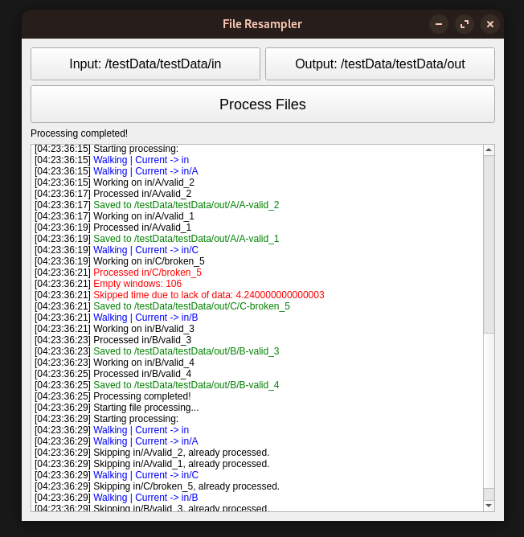

# WBB Resampler

This application resamples data files in **Nintendo Wii Balance Board (WBB)** format using a specified resampling method **(SWARII)**. It is designed with a simple GUI to select input and output folders and process files.



## Prerequisites

Before you install the application, make sure you have the following:

- **Python** 3.6 or higher
- **PyQt5** library for the GUI
- **NumPy** for data handling
- **resampling** package for data resampling (or make sure the custom `SWARII` class is installed and accessible)

## Installation & Update

1. Open the terminal, Command Prompt, or PowerShell (Windows).

2. Clone the repository:
    ```bash
   git clone https://github.com/derwesx/WBB-Resampler.git
   cd WBB-Resampler
    ```
3. To update the repository:
   ```bash
   cd WBB-Resampler
   git pull
   ```

### For Linux/Mac

3. Run the installation script:

```bash
#!/bin/bash

# Detect the OS and install accordingly
OS="$(uname -s)"

case "$OS" in
    Linux*)
        echo "Detected Linux. Running installation..."
        chmod +x ./install/install_linux.sh
        ./install/install_linux.sh
        ;;
    Darwin*)
        echo "Detected macOS. Running installation..."
        chmod +x ./install/install_mac.sh
        ./install/install_mac.sh
        ;;
    *)
        echo "Unsupported OS: $OS"
        exit 1
        ;;
esac

```

### For Windows

3.1. Download & Install [Python](https://www.python.org/ftp/python/3.11.3/python-3.11.3-amd64.exe)

[Python 3.11](https://www.python.org/ftp/python/3.11.3/python-3.11.3-amd64.exe)

3.2. Run the installation script:
    
```powershell
.\install\install_windows.bat
```

This will install the required dependencies for running the application.

## Usage

Once installed, run the application using the following command:

```bash
cd app
python3 main.py
```
or
```bash
cd app
python main.py
```

## References
Audiffren, J., & Contal, E. (2016). Preprocessing the Nintendo Wii Board Signal to Derive More Accurate Descriptors of Statokinesigrams. *Sensors (Basel)*, *16*(8), 1208. [https://doi.org/10.3390/s16081208](https://doi.org/10.3390/s16081208). PMID: [27490545](https://pubmed.ncbi.nlm.nih.gov/27490545/); PMCID: [PMC5017374](https://www.ncbi.nlm.nih.gov/pmc/articles/PMC5017374/).
